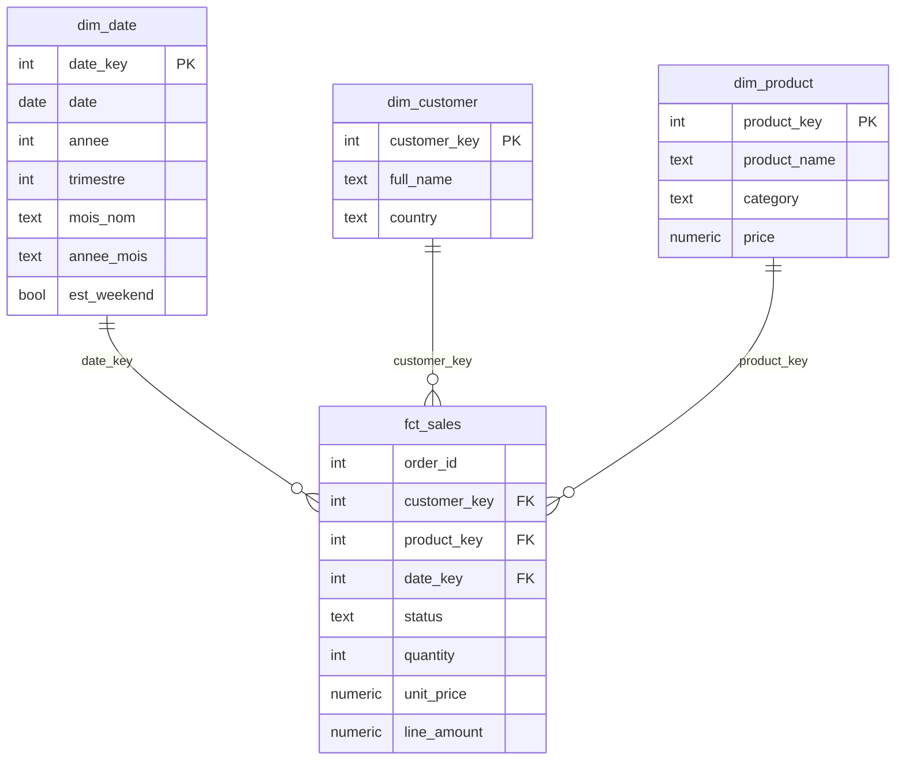

# Modèle en étoile

Une table de faits au centre, trois dimensions autour. **Aucune relation entre
dimensions** (sinon = flocon ou ambiguïté) : tout passe par `fct_sales`.

## Relations à créer dans Power BI

| De (dimension) | Vers (faits) | Cardinalité | Sens du filtre |
|---|---|---|---|
| `dim_date[date_key]` | `fct_sales[date_key]` | 1 → * | simple (dim → faits) |
| `dim_customer[customer_key]` | `fct_sales[customer_key]` | 1 → * | simple |
| `dim_product[product_key]` | `fct_sales[product_key]` | 1 → * | simple |

## Règles respectées

- **Filtre à sens unique** (dimension → faits) : évite les ambiguïtés de calcul.
- **Grain unique** de `fct_sales` = une ligne de commande (jamais mélanger deux grains).
- **`dim_date` marquée comme table de dates** → débloque la time intelligence.
- **Dimensions dénormalisées** (catégorie dans `dim_product`, pas de table
  séparée) = étoile, pas flocon → moins de relations, requêtes plus simples.
